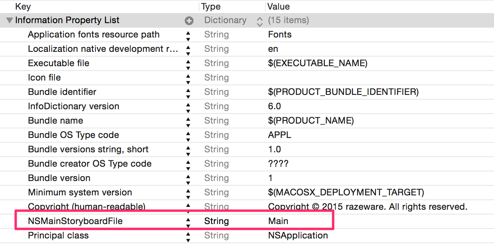
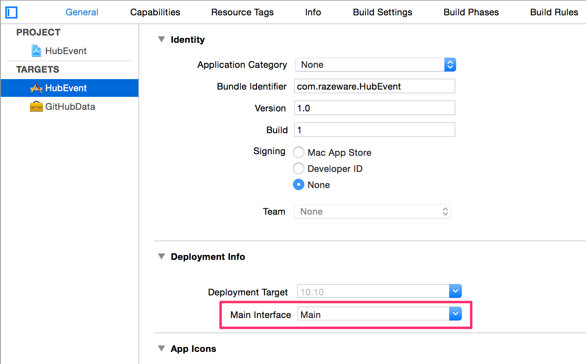
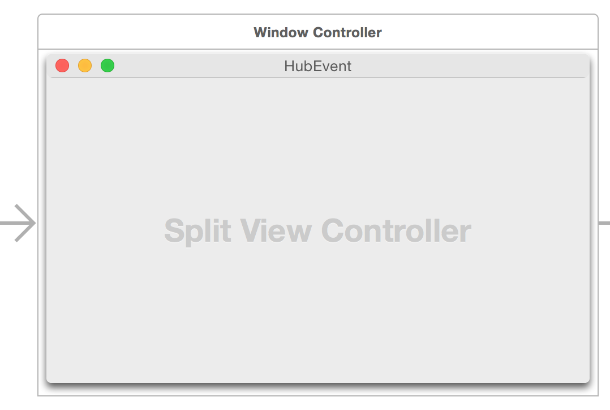
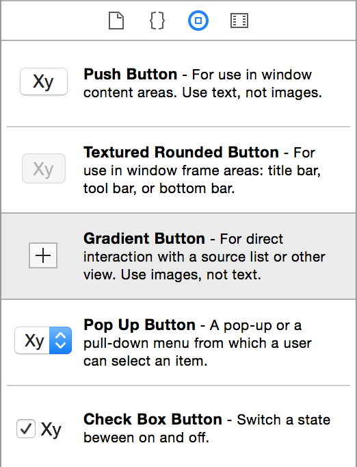
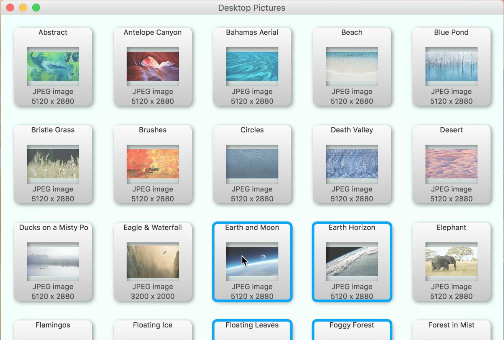
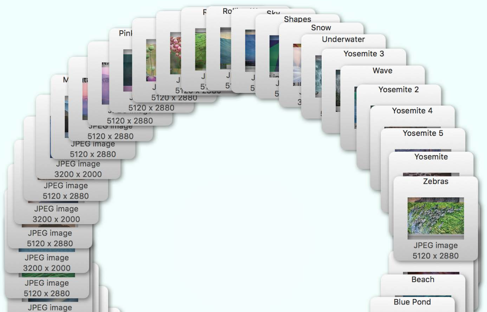
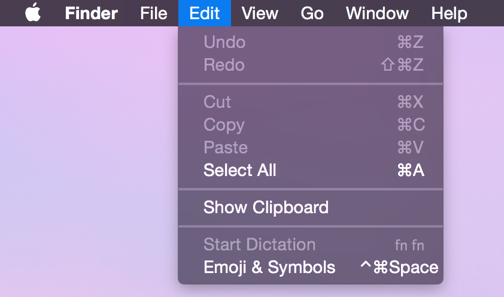
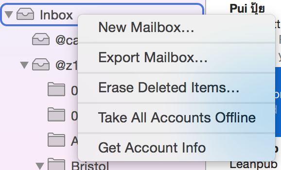

# Introduction to developing for OS X: Anatomy of an OS X App

## Introduction

In the previous article you discovered how to install Xcode, before running through a brief tour of its major features. In this tutorial you'll turn your attention to OS X apps themselves - specifically how they are architected.

By the end of this article you'll have a good grounding in how the different parts of an OS X app fit together, although not necessarily a wide-ranging understanding of how each of them works.

## Prerequisites

To build apps for OS X, you need a computer running OS X, which means an Apple Mac. You'll also need Xcode installed - if you haven't done this yet, you should take a look at the previous tutorial to learn how to get set up.

## How does an app start?

Your journey through an OS X app starts right at the beginning - looking at how an app actually _starts_.

There are three components that you need to be aware of when considering the OS X app start process:

- __App Delegate__ The entry point for code. The App Delegate provides methods associated with both the lifecycle of the app, and its interaction with the operating system. This is your first opportunity to run code, and provides you with notifications from OS X, such as Handoff requests, command line arguments and push notifications.
- __Storyboard__ Storyboards have a designated "entry point", and this allows the system to construct the UI at app launch. The entrypoint looks like an arrow on the left hand side of a scene:

This denotes which of the scenes in the storyboard will form the initial UI of your app.
- __Info.plist__ You can have multiple storyboards within your app, so how does OS X know which one it should use as the initial UI? This information (and a load of other useful things) is stored inside the __Info.plist__ file.  You can see the relevant entry below:

This file contains lots of useful app configuration options, many of which are exposed through the target configuration screen in Xcode. The image below shows the same storyboard setting in a more user-friendly location:

Starting an app is _slightly_ more complicated than this, but these three places explain where you can interact and configure your app's startup. Now that you've got your app up and running it's time to take a look at a very important aspect - its User Interface. 

## User interface

You're already aware of the fact that the UI can be provided by a storyboard, but what does this actually mean? In this section you'll cover the different UI components - what they represent and how they fit together.

TK: DIAGRAM

### Window

The UI for your app will be contained within one or more window objects. These represent an area of the screen for which your app is responsible for providing the UI. The operating system runs a window manager that handles the moving and resizing of these windows, updating your app as the user makes these changes.

In addition to representing the visualization of your app, the window object also handles passing user events triggered by user interaction with the mouse and keyboard into your app.

Although you can interact directly with a window object, often they're managed by window controllers - especially when used in conjunction with storyboards.

A window controller is responsible for the loading of the window itself, and allows you to hook into different events throughout the lifecycle of the window.

A storyboard would contain at least one window controller, which is represented as follows:

Window controllers are represented by the `NSWindowController` class, and as you configure your different windows, you would normally create different subclasses to manage their individual behavior.

### Views

The window specifies the area of the screen that your app is responsible for drawing on, but not what to draw. This is one of the primary responsibilities of the view - providing you with functionality to draw on the screen.

Views are rectangular in shape, and are represented by the `NSView` class. Views exist within a hierarchy - i.e. any view can contain zero or more subviews - allowing you to construct a complex layout using much simpler, reusable view components.

#### View Controllers

In the same way that windows are managed by a window controller in storyboards, views are managed by a view controller class. This links the view hierarchy in with the the model layer, either by manipulating properties directly, or through Cocoa bindings.

In a typical application, a view controller is a reusable component that, when provided a model object of a particular type, would update all of its constituent views to represent the values of its associated model object.

TK: For example....

View controllers are represented by `UIViewController`, which provides a full range of lifecycle events - allowing you to perform custom actions at different times. For example you can fire animation as the view is about to appear on the screen with `viewWillAppear()`, or populate relevant views with data once the view hierarchy has correctly loaded with `viewDidLoad()`.

Your app is likely to be formed from a selection of custom subclasses of `UIViewController`, each responsible for a different section of a window. They're an incredibly important aspect of an app - forming the link that allows you to display the underlying data to the user.

### View components

You've discovered that views are used to draw on the screen - but how is that actually achieved? At the lowest level you can create a custom subclass of `NSView` and override the `drawRect()` method to manually draw the content of your view.

This is extremely powerful - allowing you to create completely custom views, but would be arduous if you had to do this to draw some text on the screen!

Luckily, you don't have to. AppKit contains a large selection of commonly used `NSView` subclasses that you can use to display content on the screen.

Some of the most useful examples are:

- __Label__ Displays static text. Configurable font and appearance

- __Text Field__ User-editable text control. Used to collect a string from the user.

- __Image View__ Draws an image - provided by an `NSImage` object.

- __Push Button__ One of the many button types - each of which respond to a user's mouse click.

- __Table View__ An example of one of the many view subclasses used for showing not just _one_ data object, but rather a collection of them.

These are just a few of the different view subclasses available to you as you build up the user interface of your app. You can discover the entire range in the object library within Interface Builder:

The raywenderlich.com OS X tutorial team will also be putting together a quick reference guide to different UI components over the coming months - so be sure to check back for that.

### Viewing collections

Often you'll want your app to display UI for multiple model objects at the same time - for example showing a list of upcoming appointments, or a set of photos in an album.

OS X provides two different views that are designed to show collections of model objects - in the form of table views and collection views. 

As their name suggests, table views are used to show tabular data, with rows representing individual model objects, and the columns representing attributes on those objects.

Table views are made up of cells that can be recycled as they scroll on and off screen. Data can be provided either via a data source protocol or using Cocoa Bindings.

Tables support sorting, editing and custom cells, giving you a very powerful view for displaying data.

The more generic collection view is also comprised of a collection of cells, but this time, each cell represents the entire model object. The layout of these cells is completely customizable.

Similarly to the table view, the data for a collection view can be provided either via a data source protocol, or through Cocoa Bindings. Cells are also recycled as they disappear out of the view, reducing the memory footprint.

Collection views have built in support for cell selection, animated re-ordering and grouping cells into sections.

### Handling user interaction

A key part of any OS X is allowing user interaction through the mouse, trackpad, keyboard and any other of a number of input devices. To assist with designing user input to your app, OS X provides a unified event dispatch model, built around the concept of a responder chain.

Events generated from a keyboard are known as __Key Events__, and these follow quite a complicated path to arrive at your app. Some key presses don't event make it to your app - as they are intercepted at the OS level (e.g. power button, screen brightness, volume).

Key events can represents a single key, or a key combination - and when they arrive at your app, they are first checked to see whether they are a keyboard shortcut that's bound to a menu item.

If not, they are checked to see whether the are used to navigate around the user interface of your app - e.g. tabbing between input fields. If this isn't the case, then the window works out which of its views is currently "active" (so-called first responder) before passing it the key events. These can either be interpreted as per-view commands or as characters to insert.

Keyboard input is really quite complicated, since it can affect many levels of the system and app architecture, but OS X goes a long way to assist with this processing. In many cases, you'll find that it behaves as you would expect it out of the box.

Mouse-like events are passed to your application, which establishes which window and hence view they were performed on, before passing them to your custom subclass to allow you to handle them appropriately. The responder class (which views inherit from) includes methods you can override which get called when a clicks and moves the mouse.

Trackpads offer lots of additional gestures to a traditional mouse, so the concept of gesture recognizers has been borrowed from iOS. These can be use to interpret a sequence of multi-finger touches into a semantic action - such as a pan or rotation.

Gesture recognizers offer a much higher level of interpretation of mouse-like events, and they're associated with views and can intercept all the mouse-like events associated with that view.

The event handling architecture in OS X is quite complicated, but the defaults go a long way to handling many common cases. The power of the responder chain makes it easy to handle events at the highest level possible.

### Menus

Menus are collections of different actions that you can associate with your app. Menus can appear in different places, including:

- __Menu Bar__ this is bar along the top of the screen

- __Context Menus__ appear when the user right clicks

- __Dock Menu__ when the user long-presses the dock icon

All of these menus can be configured in Interface Builder, allowing you to configure their appearance, the hierarchy they appear in and to associate actions with each item.

 

## Data Layer

The user interface is an enormously important part of your OS X app, but it's probably not the _entirety_ of your app. Most apps provide a user interface so that users can interact with an underlying data model.

Data models depend heavily on the domain in which your app exists - there's no magical solution to building a data layer. In fact, it's often the case that you'll use the object oriented language features available in Swift to create a set of objects that model the domain of your app.

It's extremely important that the data layer should be separated out from the user interface, making your software your software more maintainable and less error-prone. OS X supports this architecture through Cocoa Bindings - a technology that wires up model objects to the UI and ensures that they are automatically kept in sync with each other.

You can create a completely separate dynamic framework to contain your data layer - completely separating it from the UI layer. This can allow the same data layer to be used in multiple apps - possibly even shared between an OS X and an iOS app, and increases testability.

Although you can create your own data layer, Apple provides a framework called Core Data. This is a comprehensive framework for creating an object graph to completely model your entire data layer. It supports persistence to disk, data validation, undo and much more.

Core Data has great support for Cocoa Bindings, meaning that it's really easy to integrate your model editing UI with a Core Data backend to build the bulk of your app really quickly.

## Other useful Cocoa functionality
- Just a couple of sentences about where to look:
  + Networking
  + MapKit & CoreLocation
  + Contacts
  + WebKit

## Where to go from here?
- Next article will introduce UI concepts
- Links to Apple documentation
