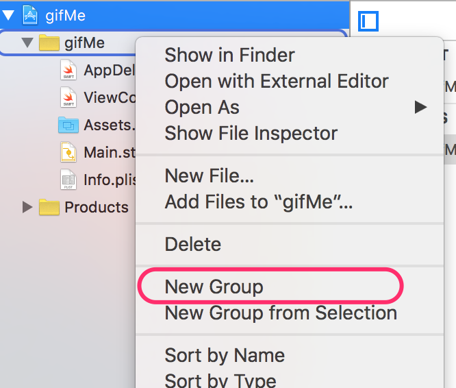
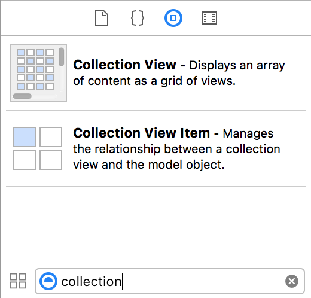
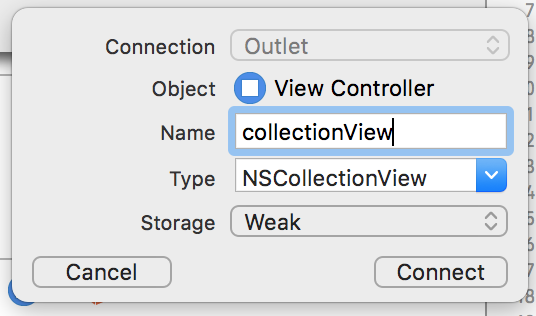
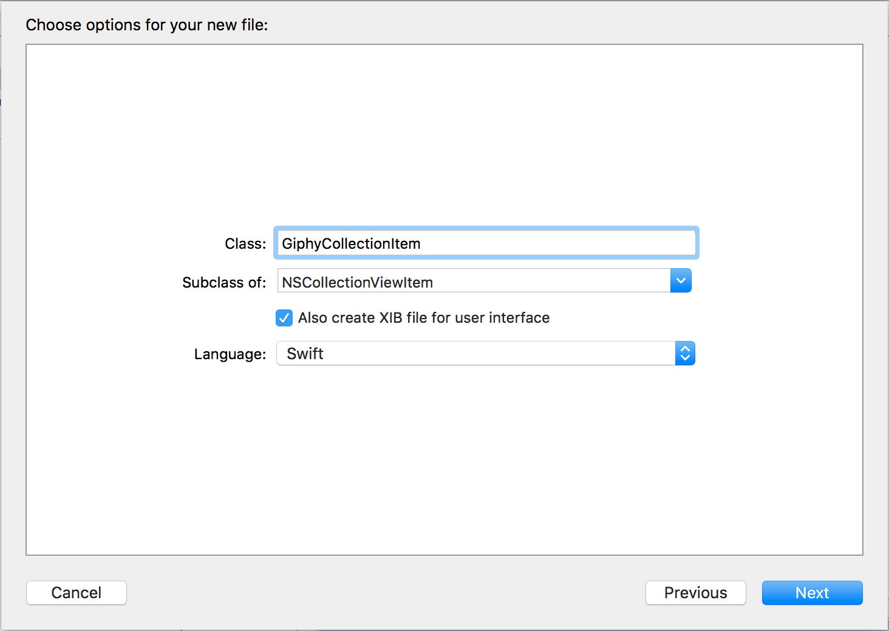
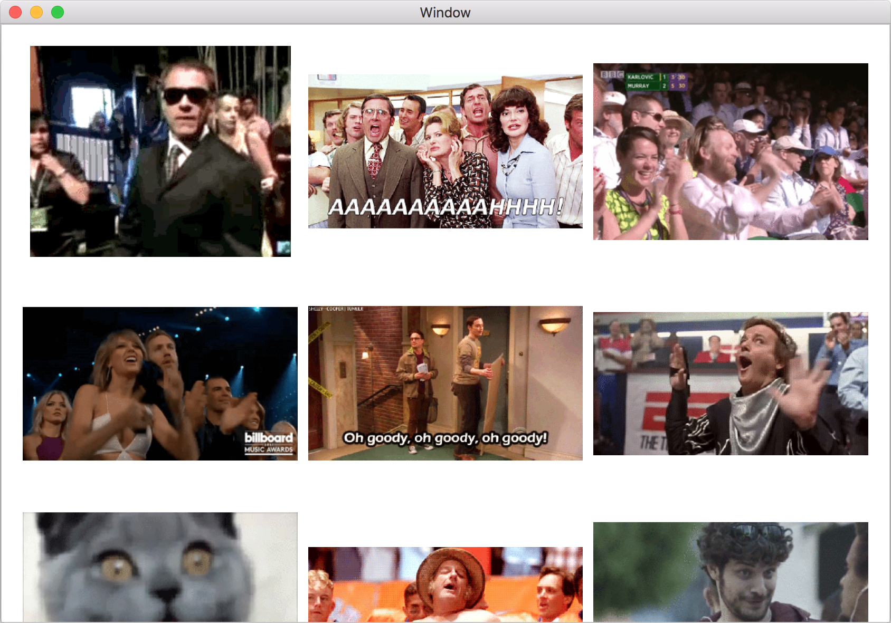

# Introduction to developing for OS X: Your First App

## Introduction
- UI very important
- Should build as much as possible in Storyboards
- Outline

## Prerequisites
- Mac
- OS X
- Xcode
- Link to tooling

## Creating the Project

Open Xcode and click __Create a new Xcode project__ to start your new app. Choose __OS X \ Application \ Cocoa Application__:


Set the product name __gifMe__, the language to __Swift__ and ensure that the __Use Storyboards__  is checked:


Choose a location on disk to save your project and then click __Create__ to open your empty project.

Build and run __gifMe__ to check that everything is working:


Great - so the app runs, but it does _absolutely nothing_ yet. In the next section you're going to build the data layer that will perform the GIF searches.


## Data Layer

The data layer is responsible for querying the giphy API with a search term, and then returning the results in a useful form.

To start, you're going to create a Swift struct that will model each search result.

__Right click__ on the yellow __gifMe__ group, and use the menu to create a new group:



Call this group __Data Layer__. Right click on this new group, and select __New File...__:


Choose __OS X \ Source \ Swift File__ and call the new file __Giphy.swift__:


Add the following code to this new file:

```swift
struct GiphyItem {
  let id: String
  let caption: String
  let url: NSURL
}
```

This defines a struct with three different properties - `id` is a unique string returned by giphy, the caption is string associated with the item and `url` is the location the GIF can be downloaded from. For an app as simple as __gifMe__, this is all you need in your data model - sweet, huh?

### JSON Parsing

The giphy API returns JSON, and you need to convert this into your new `GiphyItem` structs. Rather than write all the guts of this code yourself, you're going to use a simple library called __SwiftyJSON__ to do the heavy lifting.

Download __SwiftyJSON.swift__ and drag it from Finder into the __Data Layer__ group in your Xcode project. When asked, ensure that __Copy items if needed__ is checked:


This adds the __SwiftyJSON__ functionality, which will make parsing the giphy JSON a lot easier.

You can now add an initializer for `GiphyItem` that accepts a `JSON` object. Copy the following into __Giphy.swift__:

```swift
extension GiphyItem {
  init?(json: JSON) {
    guard let id = json["id"].string,
      let caption = json["caption"].string,
      let urlString = json["images"]["fixed_height"]["url"].string,
      let url = NSURL(string: urlString) else {
        return nil
    }
    self.init(id: id, caption: caption, url: url)
  }
}
```

This code creates a new initializer for `GiphyItem` that extracts the relevant fields from a `JSON` object. __SwiftyJSON__ provides the functionality that allows you to use subscripting to extract data from a JSON object.

Next you need to create a function that will perform the search - querying the giphy API and returning an array of `GiphyItem` results. In order to assist with this, you need to add another file to your project. This file contains helper functions to construct the giphy API URL for a given search term, and to convert the returned JSON into an array of `GiphyItem` objects.

Download __GiphyUtils.swift__, and drag it from the finder into the __Data Layer__ group. Once again, ensure that __Copy items if needed__ is checked.

You can now construct a function that will perform the API query.

Add the following code to __Giphy.swift__:

```swift
func searchGiphy(searchTerm: String, resultHandler: (GiphySearchResult) -> ()) {
  // 1:
  guard let url = urlForSearchTerm(searchTerm) else {
    print("Error creating the search URL")
    return
  }
  // 2:
  let task = NSURLSession.sharedSession().dataTaskWithURL(url, completionHandler: {
    (data, response, error) in
    if let error = error {
      print("Error: \(error.localizedDescription)")
      resultHandler(GiphySearchResult.Error(error))
      return
    }
    // 3:
    let json = JSON(data: data!)
    // 4:
    let giphyItems = convertJSONToGiphyItems(json)
    // 5:
    resultHandler(GiphySearchResult.Result(giphyItems))
    
  })
  // 6:
  task?.resume()
}
```

1. `urlForSearchTerm(_:)` is a function provided by __GiphyUtils.swift__. It generates the correct URL for the given search term. The `guard` statement ensures that a URL was successfully returned.
2. Requesting data from the network involves creating an asynchronous task, using the URL and a closure that defines what happens when the task completes.
3. __JSON__ is the main type within __SwiftyJSON__. It's initialized with the data received from the giphy API.
4. `convertJSONToGiphyItems(_:)` is another function provided by __GiphyUtils.swift__. It uses the custom initializer for `GiphyItem` you created earlier to generate an array of `GiphyItem` structs.
5. Since this is an asynchronous function, rather than returning the result, you provide it via a callback function.
6. Once you've created the task, calling `resume()` will start the network request.

Note that this method doesn't return any values. This is because the network request is an asynchronous process, so instead you provide a `resultHandler` closure that gets called once the request has completed (see step 5).

You've now created a model to represent the search results, and a function that will query the giphy API with a search term. That's it for the data layer - time to move your attention to the UI!


## User Interface

The user interface of gifMe is made up of two parts - the results view, and the search interface. You're going to start by creating the results display, before moving on to adding the search functionality.


### Results UI

The results will be shown in a collection view, which is a way to display a set of elements - by default in a grid-like fashion. As the size of the collection view changes, it'll re-arrange the items automatically.

Collection views in OS X are represented by the `NSCollectionView` class. You are going to build the UI in Interface Builder, and then configure it in code.

Open __Main.storyboard__ and find the __View Controller__ scene. In the current configuration, this view controller represents the entire content of the view. You're going to add a collection view to this scene, which will show the images from the search results.

Use the search box at the bottom of the __object library__ to find the __Collection View__:



__Drag__ a collection view from the __object library__ on to the __View controller__ scene:


This will add a collection view to the scene, and also a new scene scene which represents the layout for each of the items in the collection view:


Due to a bug in the current version of Xcode, you will have to provide the layout for the collection view item in a separate XIB file. Select the __Collection View Item__ scene and press __delete__ to remove it.

You want to specify that the collection view should fill the entirety of the view controller. You will do this using a system called Auto Layout. This is a layout engine that can determine the sizes and positions of view elements at runtime, as dictated by a set of relationships that you provide at design time. You want to specify that the collection view should fill the entire scene, so you'll provide constraints that specify that its edges should be pinned to the edges of its containing view.

Select the collection view, and then use the __Pin__ menu in the bottom bar to specify that there should be a distance of __0__ around each of the edges. Ensure that __Update frames__ is set to __Items of New Constraints__ before adding the constraints.


That's all you need to do with the layout of the collection view itself.

Currently, there is no way to access the collection view from code - which you'll need to be able to do to configure it. Xcode has a system whereby you can create an outlet in code which will attach to the object in the storyboard at run time. You're going to do that now for the collection view.

Open the assistant editor in Xcode by selecting it in the menu bar:


Use the jump bar in the assistant editor to select __Automatic \ ViewController.swift__.


Back in IB, locate the collection view in the __Document Outline__:


__Ctrl-Drag__ from the __Collection View__ over to __View Controller.swift__:


Name the new outlet `collectionView`:



You'll see that this adds the following property to __ViewController.swift__:

```swift
@IBOutlet weak var collectionView: NSCollectionView!
```

You'll use this item later - but first you need to provide the design for each item in the collection view.


### Collection View Item

Each search result will be represented by a collection view item - which is a subclass of `NSViewController`. You'll need a custom subclass so you can write code to display your `GiphyItem` model object correctly.

Use the menu to select __File \ New \ File...__ and find __OS X \ Source \ Cocoa Class__ in the template chooser. Name the class __GiphyCollectionItem__, and make it a subclass of __NSCollectionViewItem__. Ensure that __Also create XIB file for user interface is checked__:



You can use Interface Builder to provide the design for these items, in a cut-down version of a storyboard, called a XIB. Whereas storyboards support multiple scenes, a XIB has no concept of flow between scenes - instead just providing layout for a view.


Open the newly-created __GiphyCollectionItem.xib__ - you can see a blank custom view. Find an __Image View__ in the __Object library__ and drag it onto the blank view:


As before, use the __Pin__ menu to create the Auto Layout constraints to set sizes of the 4 margins to be __0__.

You now need to wire this new image view up to the collection view item class. Since the Xcode knew you were going to use this XIB with the `GiphyCollectionItem` class you created, it has already linked the __File's Owner__ property to the class - you just need to link the image view.

In the __Document Outline__, __Ctrl-Drag__ from the __File's Owner__ to the __Image View__ inside the __Custom View__. Select __imageView__ in the popup box.


That's all you need to do for the design of the collection view item - time to move your attention to writing its code.


### Loading Images

Remember back to the `GiphyItem` data model - it doesn't provide an image, but a URL where the image can be found. Therefore, the collection view item will be responsible for downloading the GIF.

Add the following properties to the `GiphyCollectionItem` class in __GiphyCollectionItem.swift__:

```swift
private var imageDownloadTask : NSURLSessionDataTask?
private static let imageCache = NSCache()
```

`imageDownloadTask` is the network request that you'll create to download an image. You need to keep a reference to it so that you can cancel it if you need to. GIFs are very large files, so rather than re-downloading them repeatedly, you're going to cache them in `imageCache`.

Add the following function to `GiphyCollectionItem`:

```swift
private func loadImageAysnc(url: NSURL, callback: (NSImage) -> ()) {
  // 1:
  imageDownloadTask = NSURLSession.sharedSession().dataTaskWithURL(url) {
    (data, _, _) in
    if let data = data {
      // 2:
      let image = NSImage(data: data)
      // 3:
      dispatch_async(dispatch_get_main_queue()) {
        // 4:
        callback(image!)
        // 5:
        self.imageDownloadTask = nil
      }
    }
  }
  // 6:
  imageDownloadTask?.resume()
}
```

1. As you did with the API request - create a download task to grab the GIF.
2. Once the data has arrived, convert it into an `NSImage`.
3. Download tasks can run on an arbitrary background queue. Since you're going to be calling back to the UI, marshal the callback onto the main queue.
4. Provide the image back to the caller via the `callback` closure.
5. This image download succeeded, so remove the reference to it.
6. Once you've create the task, you have to call `resume()` to actually start it.


Now that you've created a helper function to actually download the image, you can use this to grab the image for a specific `GiphyItem`. Add the following function to the same class:

```swift
private func updateImageForGiphyItem(item: GiphyItem) {
  // 1:
  imageDownloadTask?.cancel()
  // 2:
  if let image = GiphyCollectionItem.imageCache.objectForKey(item.id) as? NSImage {
    self.imageView?.image = image
  } else {
    // 3:
    loadImageAysnc(item.url) {
      image in
      // 4:
      self.imageView?.image = image
      GiphyCollectionItem.imageCache.setObject(image, forKey: item.id)
    }
  }
}
```

1. Before attempting to download a new image, cancel an existing download task, if there is one.
2. Check to see whether the image you're trying to download is already present in the cache. `NSCache` is essentially a clever mutable dictionary - you're using the `id` property of the `GiphyItem` to index the cached images. If the image is in the cache, update the `imageView` to display it.
3. The image isn't cached, so use the function you just created to download it asynchronously.
4. Once the image has successfully downloaded, update the `imageView` with the new image, and cache the image so it won't be downloaded next time it's needed.

You're almost there with the collection view item - the final piece of the puzzle is to call this image update code when the collection view item is provided with a new `GiphyItem` model object. Add the following property to the class:

```swift
  var giphyItem : GiphyItem? {
    didSet {
      if let giphyItem = giphyItem {
        updateImageForGiphyItem(giphyItem)
      }
    }
  }
```

This checks that the new value isn't `nil` before calling the function you just created to download the image and update the view.

That's everything you need to do in the collection view item. You now just need to add some code to make the collection view use your custom item.


### Collection View

You've already created an outlet property for the collection view in __ViewController.swift__, but now you need to configure it. There are two ways to tell a collection view what content it should display - either via data-binding or via a data source. In this introductory tutorial, you're going to use the data source method.

`NSCollectionView` has a `datasource` property. This can be set to any object that adopts the `NSCollectionViewDataSource` protocol. This protocol defines three methods which you must implement to tell the collection view what content it should display.


First, add the following to `ViewController`:

```swift
var giphyItems : [GiphyItem]? {
  didSet {
    collectionView.reloadData()
  }
}
```

This defines a property - an array of `GiphyItem` objects, which, when updated, will cause the collection view to update itself to reflect the new data.

Add the following class extension to the bottom of __ViewController.swift__:


```swift
extension ViewController : NSCollectionViewDataSource {
  // 1:
  func numberOfSectionsInCollectionView(collectionView: NSCollectionView) -> Int {
    return 1
  }
  
  // 2:
  func collectionView(collectionView: NSCollectionView, numberOfItemsInSection section: Int) -> Int {
    return giphyItems?.count ?? 0
  }
  
  // 3:
  func collectionView(collectionView: NSCollectionView, itemForRepresentedObjectAtIndexPath indexPath: NSIndexPath) -> NSCollectionViewItem {
    // 4:
    let item  = collectionView.makeItemWithIdentifier("GiphyCollectionItem", forIndexPath: indexPath)
    
    // 5:
    if let item = item as? GiphyCollectionItem {
      item.giphyItem = giphyItems?[indexPath.item]
    }
    
    return item
  }
}
```

1. A collection view is made up of 1 or more sections - each of which can contain its own set of items. Here, you only need one section.
2. The collection view needs to know how many items there will be in each section. Since there's only one section in your collection view, the number of items is simply the total number of items in the `giphyItems` array.
3. The collection view will call this method once for each item in the collection view - requiring you to provide it with the item you want to display.
4. The `makeWithIdentifier(_:, forIndexPath:)` method will create a collection view item using the XIB specified by the name. It also implements recycling - once an item has scrolled off screen it'll be recycled to represent a different model object in a different location. This has great memory benefits, but can make code associated with the item more complicated (hence canceling any currently running download tasks).
5. If the created item is of the correct type, provide it with the appropriate model object so that it can display it.


You've now made the `ViewController` class adopt the `NSCollectionViewDataSource` protocol - you just need to tell the collection view where to look for its data.

Add the following two lines to the end of the `viewDidLoad()` method:

```swift
collectionView.dataSource = self
collectionView.minItemSize = NSSize(width: 200, height: 200)
collectionView.registerClass(GiphyCollectionItem.self, forItemWithIdentifier: "GiphyCollectionItem")
```

In addition to configure the data source for the collection view, this also sets the minimum size, and registers your custom `GiphyCollectionItem` class so that the collection view can use it.

You've actually now finished implementing the results display. It'd be nice to test it though right? Add the following code to the end of the same `viewDidLoad()` method:

```swift
searchGiphy("it works") {
  giphyResult in
  switch giphyResult {
  case .Error(let error):
    print(error)
  case .Result(let items):
    self.giphyItems = items
  }
}
```

This calls the `searchGiphy()` function that you created back in the data layer, and then sets the `giphyItems` property on `ViewController` to the results.

Build and run gifMe to see the results of all the UI work you've been doing:



Wow! That's pretty cool right? You've already managed to create a fairly cool app, without too much difficulty.

Something will probably stick out at you though... The search is returning GIFs, but they aren't animating. You're going to fix that next.


## Adding Animation

`NSImageView` supports animating images out of the box - you just need to toggle a property. You could do this by default for the collection view item, but having a screen full of animating GIFs isn't a great UX. Instead you're going to toggle the animation property when the user clicks on the image view.


## Where to go from here
- Summarise what you've learnt in these tutorials
- Mention that we'll have loads of new content as part of the OS X team
- Link to Apple's documentation
