# Introduction to developing for OS X: Your First App

This introductory series about building apps on OS X has covered a lot of ground. If you haven't already read them, go and take a look now so that you have a grounding from which to build in this tutorial. This is what you've already learned:

- __Tooling__ In part one you learned about the many facets of Xcode - and had a glimpse of how you could use it to start developing for OS X.
- __App Anatomy__ The second part covered a lot of the theory behind how OS X app are constructed - from the data layer, through the binary assets, to designing the UI.

In this final part, you're going to dive deep into the world of OS X development, by creating your first ever app!

The app you're going to build is a magic-8 ball app, to help you make all those difficult decisions in day-to-day life. You'll start from scratch - first creating a "Hello World!" app before moving on to creating an app to solve all your problems!

> __Note:__ This app requires OS X El Capitan, so if you don't have it - make sure you upgrade to it before trying to follow the tutorial.

## Creating the Project

Open Xcode and click __Create a new Xcode project__ to start your new app. Choose __OS X \ Application \ Cocoa Application__:

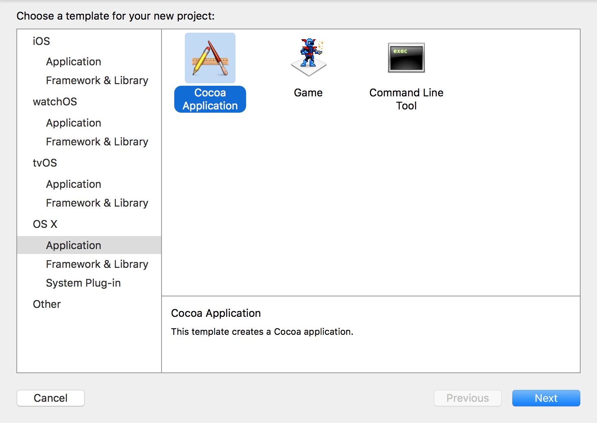

Set the product name __MagicEight__, the language to __Swift__ and ensure that the __Use Storyboards__  is checked:


Choose a location on disk to save your project and then click __Create__ to open your empty project.

Build and run __MagicEight__ to check that everything is working:


Great - so the app runs, but it does _absolutely nothing_ yet. In the next section you're going to turn your app into the first app you should always write when learning a new platform—hello world!

## Hello World!

The user interface for an OS X app is provided by the storyboard file, using interface builder. This allows you to design the UI in a very visual manner, and reduces the amount of complex code you have to write.

Open __Main.storyboard__ by selecting it in the Project Navigator in the left-hand pane:

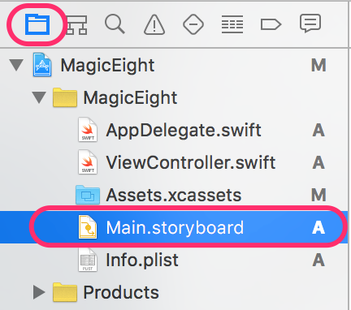

You'll now see the storyboard open in the center panel:

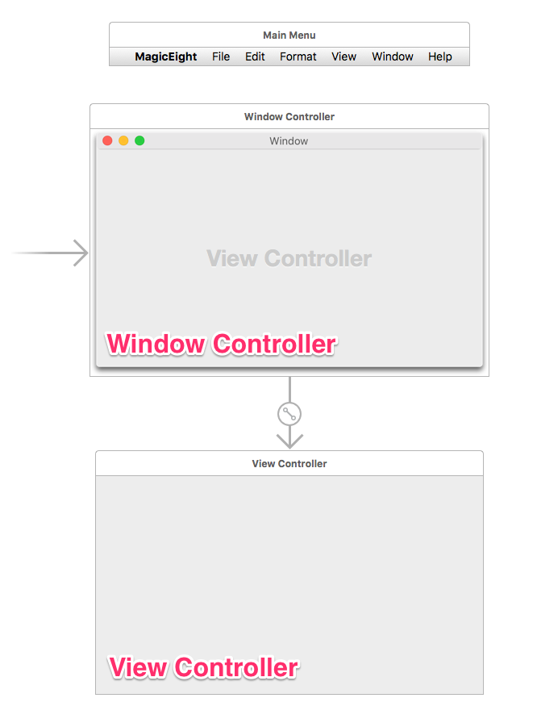

The template storyboard contains three components:

- __Menu Bar__ Controls the menu that appears when the app runs.
- __Window Controller__ Manages the default window that appears. This uses one or more view controllers to manage their content.
- __View Controller__ Responsible for a region of the window - both for display and handling user interaction.

During this introductory tutorial you'll concentrate your efforts on the view controller.

First up, you need to add a label to the view controller to display your welcome text. A label is actually a special type of `NSTextField` that's designed for displaying a single line of non-editable text - perfect for "Hello World".

To add your first label, follow this set of steps. There's an annotated screenshot so you can see to do:

1. If it's not already visible use the icon in the toolbar to show the utilities panel on the right-hand side.
2. Use the icon towards the bottom of the panel to open the __Object Library__. This, as the name suggests, is a catalog of things you can drag onto the storyboard canvas to build your layout.
3. Use the search box at the bottom to search for __label__.
4. You'll see the label object highlighted in the library.


Now that you've found a label, you can set about using it. Drag the label from the object library onto the view controller:


To change the text content of the label, select the __Attributes Inspector__ tab of the Utilities panel, locate the __Title__ field and enter __Hello World!__:


You can use the attributes inspector to control the appearance and behavior of the different controls that OS X offers. Find the __Font__ entry, and click the __T__ icon to the right to open the font panel. Change the style to __Thin__ and the size to __40__. Click __Done__ to save the changes:


Cast your eyes back over to the view controller canvas and you'll see something strange:


Although you've adjusted the text and size of the label, it has remained the same size, causing nearly all of the text to disappear. Why is this?

Although you placed the label on the view controller's canvas, you haven't actually told OS X _how_ it should position it. The view controller appears at one size in the storyboard, but once it's running in the app, the user can change the window size - so you need to specify how the label should be positioned for _any_ window size.

This sounds like it might be a really difficult task, but luckily Apple has your back. OS X uses a powerful layout engine called Auto Layout, in which the relationships between different components of the view are expressed as rules. These rules are then interpreted at runtime to calculate the size and position of each element within the view.

> __Note:__ Auto Layout is a complex topic, and this introductory tutorial won't cover it in any great depth. If you'd like to read more on the topic then there are some excellent tutorials on the site targeted to Auto Layout on iOS—luckily the engine is almost identical on the two platforms. TODO: Links

Ensure that the label is selected in the view controller, and then click the __Align__ button in the lower toolbar. Select __Horizontally in Container__, ensuring the value is set to __0__ before clicking __Add 1 Constraint__ to add the constraint:


This will ensure that the label will always appear in the center of the window, irrespective of its width. You'll notice that some angry red lines have appeared in the storyboard:


This is because you've provided constraints (i.e. rules) to specify the location of the label in the horizontal direction, but you've not provided any information about the vertical axis yet.

Once again, ensure that the label is selected in the view controller, and this time click the __Pin__ menu on the Auto Layout toolbar at the bottom. Enter __30__ in the top constraint box and ensure that the I-bar beneath it is solid red. Set the value of Update Frames to __Items of New Constraints__ before clicking __Add 1 Constraint__:


Immediately you'll notice the view controller update—you can now see the entire label, and the angry red lines have changed to calming blue:


And that's your "Hello World" app done (for now). Use the "play" button to build and run, and inspect your handiwork:


Congratulations! Not very personal though is it? In the next section you'll discover how to make the traditional greeting a little more friendly.


## Handling User Input

In this section you're going to add a text field to allow the user to enter their name so that you can welcome them personally.

Before you can jump in to some code, you need to add the new user interface elements and configure their layout.

### Control Layout

As you did before, use the object library to locate and then drag a __Text Field__ and a __Push Button__ onto the view controller. Position them above the "Hello World!" label:


Remember that placing the controls on the canvas isn't enough for OS X to understand how you want them positioned as the window changes size. You need to add some constraints to convey your wishes.

Select the text field, and then __Control-Click__ the button to select both simultaneously. Then click the __Stack__ icon on the Auto Layout toolbar at the bottom of the storyboard:


This has created a new stack view containing the text field and the button. A stack view automatically generates the layout constraints required to position the contained views in a line. You can use the attributes inspector to configure many common properties of the stack view.

> __NOTE:__ `NSStackView` has been in OS X since 10.9, but received a significant update in 10.11 (El Capitan)—in line with its introduction (`UIStackView`) in iOS. Stack views are similar on both platforms, so you can check out the iOS tutorial on stack views to get up to speed. Or hang tight—there's a tutorial on `NSStackView` on its way.

Once you've started stacking it's difficult to stop. This time, you're going to stack your newly created stack view with the "Hello World!" label—in a vertical stack view.

Use the button to the left of the lower toolbar to show the Document Outline and then locate the "Hello World" control and the existing stack view. __Command-click_ them to select both:

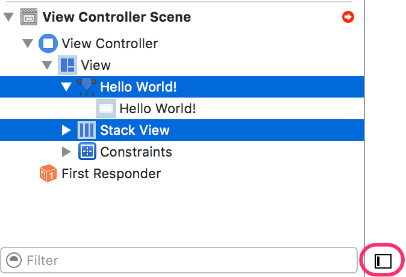

As you did before, use the __Stack__ button on the bottom toolbar to create a new stack view:

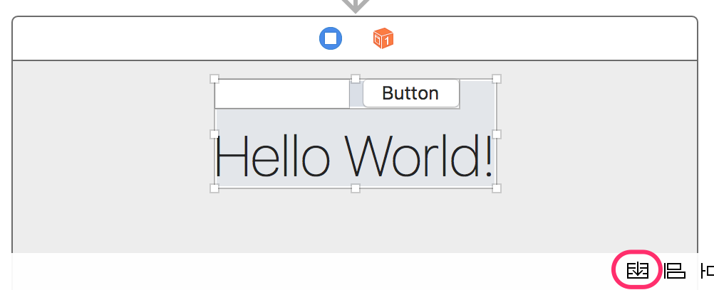

While this new stack view is selected, open the __Attributes Inspector__ and set the Alignment to __Center X__, and the spacing to __20__:

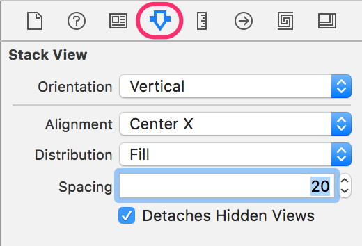

This ensures that the label and the upper stack view are nicely centered and there's a gap of 20 points between them.

A couple more bits of layout to complete before you can turn your attention to the task of handling user input.

The stack view handles the positioning of its content relative to each other, but it needs to be positioned within the view controller's view. Select the outer stack view and use the __Align__ auto layout menu to center it vertically within its container:


And use the __Pin__ menu to pin the stack view to the top, with a spacing of __30__:


Finally, to ensure that the text field always has the space for the user's name, you will fix its width.

Select the text field and use the __Pin__ menu in the bottom toolbar to specify a __Width__ of __100__. Click __Add 1 Constraint__ to save the new constraint:


With that your layout is pretty much complete—it should look like the following:

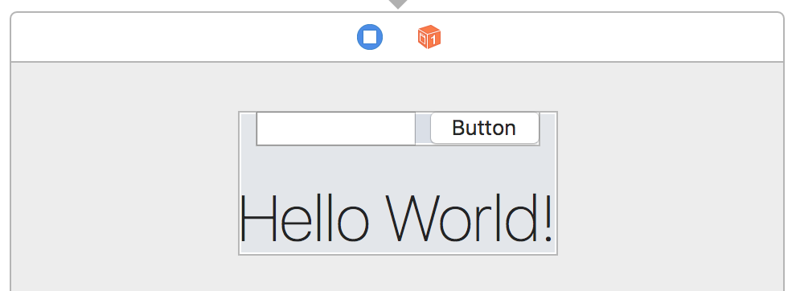

Now you can turn your attention back to those new controls you added.


### Outlets and Actions

Select the text field and open the __Attributes Inspector__. In the Placeholder field type __Name__:

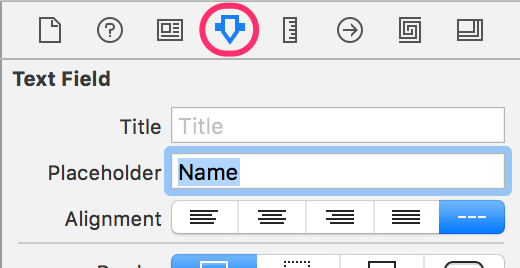

This grayed out text will instruct the user what the field is for, and will disappear as soon as they start typing.

Select the button, and again open the __Attributes Inspector__. Set the Title to __Welcome__:

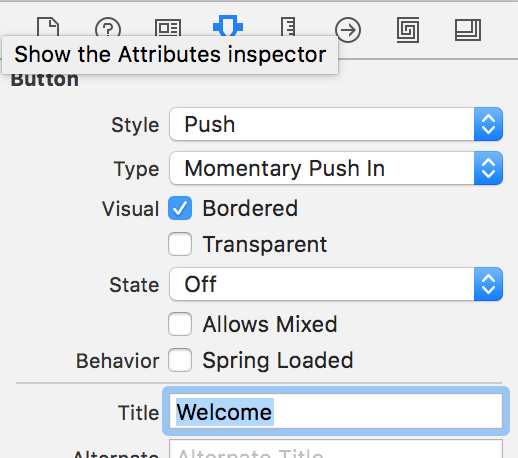

That's the cosmetic aspect done. Time to wire these two controls into code.

OS X provides a way to interact with the UI designed in a storyboard from code using outlets and actions:

- An outlet is a property in code that is connected to a component in the storyboard. This allows you to access the properties of controls within a storyboard from your code.
- Actions are functions in code that are invoked when the user interacts with the components in the UI - e.g. by clicking on a button.

You are going to add outlets for the text field and the label, and an action that will be called when the user clicks the welcome button.

The view controller you've been working on already has a skeleton class associated with it in code—in __ViewController.swift__. This is where you'll add the outlets and action.

Open the assistant editor using the button in the toolbar:


This will split the screen and show a code file alongside the storyboard. It should be displaying __ViewController.swift__, but if it isn't use the jump bar to select __Automatic \ ViewController.swift__:


__Right-click-drag__ (or __Control-drag__) from the text field in the storyboard over to the line above `override func viewDidLoad()` in __ViewController.swift__:

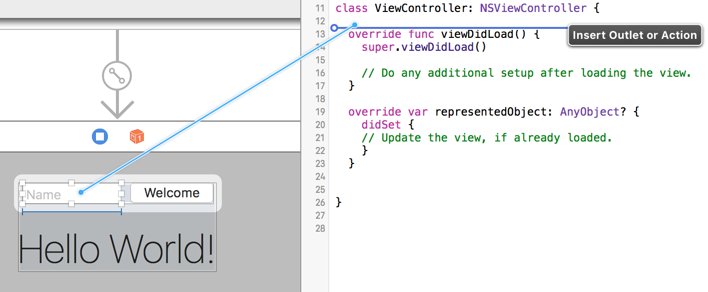

Ensure that __Outlet__ is selected and call the new outlet __nameTextField__:


This will add the following line of code to the `ViewController` class and updates the storyboard to automatically connect the text field to this property when loading the view controller:

```swift
@IBOutlet weak var nameTextField: NSTextField!
```

Repeat exactly the same process for the "Hello World!" label, this time specifying that the outlet should be called __welcomeLabel__:

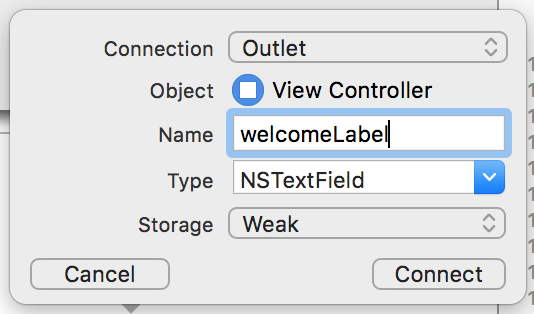

Now time to turn your attention to the button. Once again __Control-drag__ from the button in the storyboard over to the `ViewController` class:


Change the Connection to __Action__ and name it __handleWelcome__:

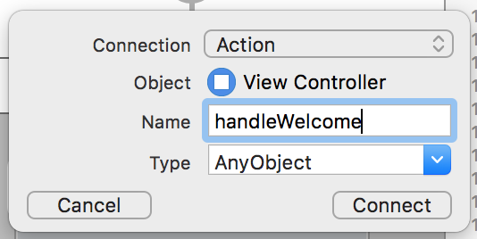

Click __Connect__ to make the connection and Xcode will add the following empty method definition to the `ViewController` class:

```swift
@IBAction func handleWelcome(sender: AnyObject) {
}
```

This method will be called every time the user clicks the button, but it doesn't currently do anything.

Add the following line to the `handleWelcome(_:)` method body:

```swift
welcomeLabel.stringValue = "Hello \(nameTextField.stringValue)!"
```

This updates the `stringValue` property of the `welcomeLabel` to a welcome message constructed using the `stringValue` of the `nameTextField`. As you might have guessed, `stringValue` represents the value currently displayed by a text-based control—be it user-entered or defined in the storyboard.

That's all the code you need to get your personalized version of "Hello World" going! Build and run to give it a try. Once the app has started, try entering your name in the __Name__ box and clicking the __Welcome__ button. You'll see your very own version of "Hello world!":

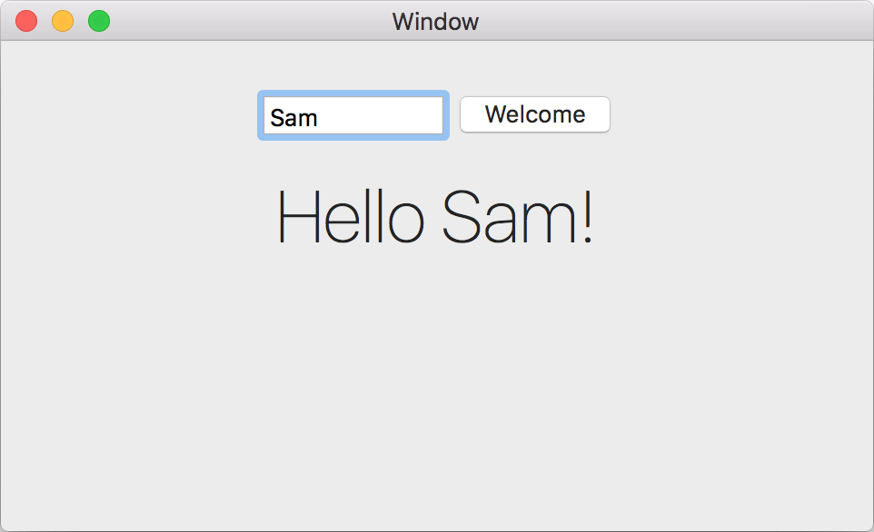

Pretty cool eh? Well, the fun doesn't stop there. Next up you're going to learn about adding images to your app, to create an amazing magic-8 ball utility!


## Assets

You were promised a magic 8-ball app at the start of this tutorial, and so far you've seen no mention of a ball. Well, that's all about to change.

An 8-ball is pretty distinctive, and it wouldn't be a very exciting 8-ball app without some visualization. [Download](TODO: URL) the images you'll need to make your app look swish. Uncompress the zip file and you'll find two images inside—representing the two sides of a magic 8-ball:

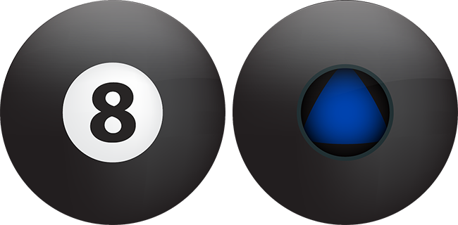

Image assets are stored in an asset catalog within an OS X app. This catalog manages the different imagery and the different resolutions required for the app icons and the in-app images. 

Open __Assets.xcassets__ by selecting it in the project navigator:


You can see that the catalog currently only contains one item - __AppIcon__. This is where you would put the artwork to give your app a cool icon.

You need to add the downloaded images to the asset catalog. Locate the images in finder, and __drag__ them both into the asset catalog:


This will create two new entries in the asset catalog:

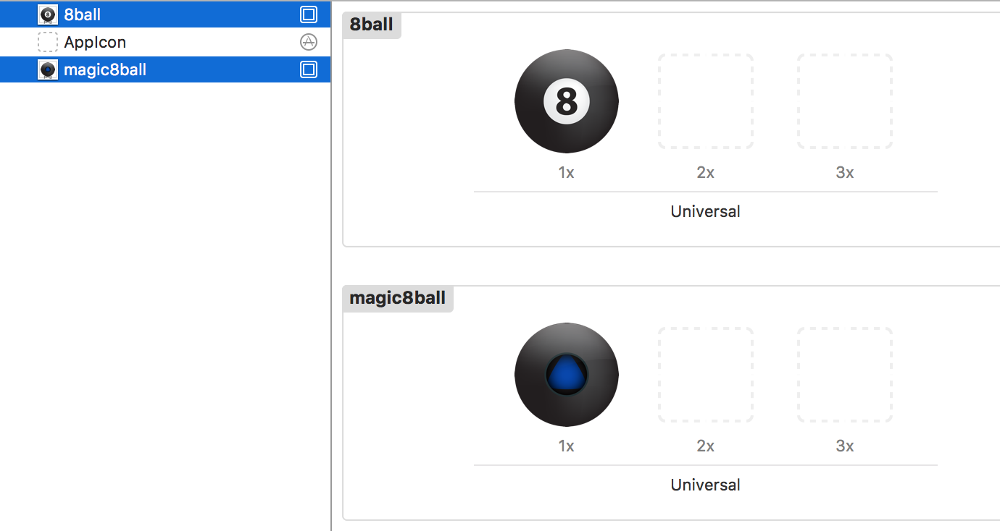

Notice that there are three "cells" for the images, and that they appear in the leftmost "1x" one. These cells represent the different screen scales - standard (1x), retina (2x) and retina-HD (3x). Normally you would provide assets for each of these cells, but in this simple project you will provide just one.

The image you've been provided is actually designed to be used at retina resolutions (2x), so drag the image from the left-hand cell to the central (2x) cell:

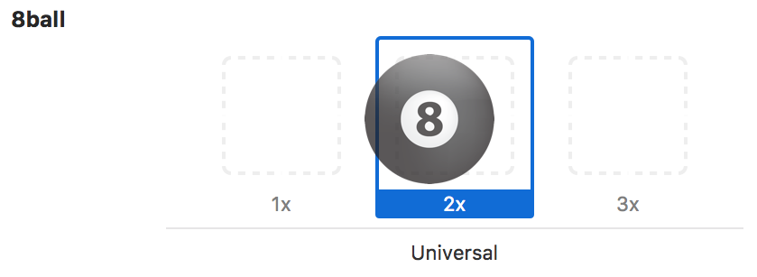

Repeat for both of the 8-balls assets, so that the asset catalog looks like this:

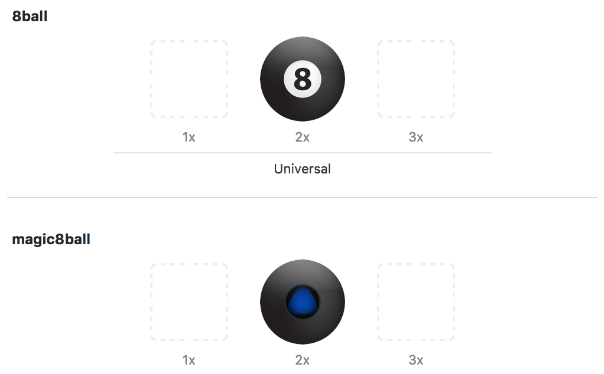

Those images are now available to use in your app—both from code and inside the storyboard. Time to put them to use.


### Displaying Images


