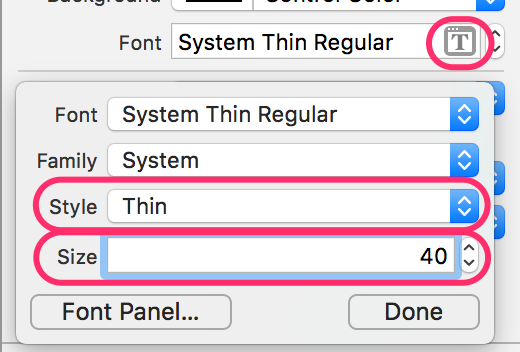
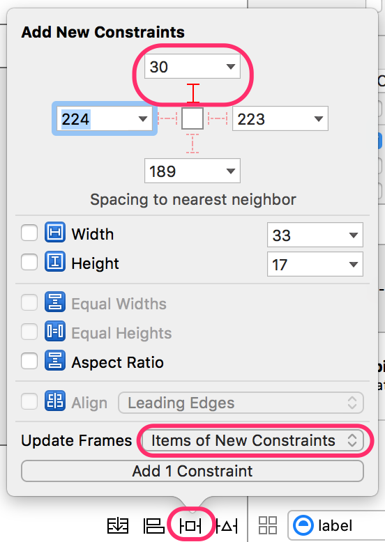

# Introduction to developing for OS X: Your First App

This introductory series about building apps on OS X has covered a lot of ground. If you haven't already read them, go and take a look now so that you have a grounding from which to build in this tutorial. This is what you've already learned:

- __Tooling__ In part one you learned about the many facets of Xcode - and had a glimpse of how you could use it to start developing for OS X.
- __App Anatomy__ The second part covered a lot of the theory behind how OS X app are constructed - from the data layer, through the binary assets, to designing the UI.

In this final part, you're going to dive deep into the world of OS X development, by creating your first ever app!

The app you're going to build is a magic-8 ball app, to help you make all those difficult decisions in day-to-day life. You'll start from scratch - first creating a "Hello World!" app before moving on to creating an app to solve all your problems!

> __Note:__ This app requires OS X El Capitan, so if you don't have it - make sure you upgrade to it before trying to follow the tutorial.

## Creating the Project

Open Xcode and click __Create a new Xcode project__ to start your new app. Choose __OS X \ Application \ Cocoa Application__:

Set the product name __MagicEight__, the language to __Swift__ and ensure that the __Use Storyboards__  is checked:

Choose a location on disk to save your project and then click __Create__ to open your empty project.

Build and run __MagicEight__ to check that everything is working:

Great - so the app runs, but it does _absolutely nothing_ yet. In the next section you're going to turn your app into the first app you should always write when learning a new platform—hello world!

## Hello World!

The user interface for an OS X app is provided by the storyboard file, using interface builder. This allows you to design the UI in a very visual manner, and reduces the amount of complex code you have to write.

Open __Main.storyboard__ by selecting it in the Project Navigator in the left-hand pane:

You'll now see the storyboard open in the center panel:

The template storyboard contains three components:

- __Menu Bar__ Controls the menu that appears when the app runs.
- __Window Controller__ Manages the default window that appears. This uses one or more view controllers to manage their content.
- __View Controller__ Responsible for a region of the window - both for display and handling user interaction.

During this introductory tutorial you'll concentrate your efforts on the view controller.

First up, you need to add a label to the view controller to display your welcome text. A label is actually a special type of `NSTextField` that's designed for displaying a single line of non-editable text - perfect for "Hello World".

To add your first label, follow this set of steps. There's an annotated screenshot so you can see to do:

1. If it's not already visible use the icon in the toolbar to show the utilities panel on the right-hand side.
2. Use the icon towards the bottom of the panel to open the __Object Library__. This, as the name suggests, is a catalog of things you can drag onto the storyboard canvas to build your layout.
3. Use the search box at the bottom to search for __label__.
4. You'll see the label object highlighted in the library.

Now that you've found a label, you can set about using it. Drag the label from the object library onto the view controller:

To change the text content of the label, select the __Attributes Inspector__ tab of the Utilities panel, locate the __Title__ field and enter __Hello World!__:

You can use the attributes inspector to control the appearance and behavior of the different controls that OS X offers. Find the __Font__ entry, and click the __T__ icon to the right to open the font panel. Change the style to __Thin__ and the size to __40__. Click __Done__ to save the changes:

Cast your eyes back over to the view controller canvas and you'll see something strange:

Although you've adjusted the text and size of the label, it has remained the same size, causing nearly all of the text to disappear. Why is this?

Although you placed the label on the view controller's canvas, you haven't actually told OS X _how_ it should position it. The view controller appears at one size in the storyboard, but once it's running in the app, the user can change the window size - so you need to specify how the label should be positioned for _any_ window size.

This sounds like it might be a really difficult task, but luckily Apple has your back. OS X uses a powerful layout engine called Auto Layout, in which the relationships between different components of the view are expressed as rules. These rules are then interpreted at runtime to calculate the size and position of each element within the view.

> __Note:__ Auto Layout is a complex topic, and this introductory tutorial won't cover it in any great depth. If you'd like to read more on the topic then there are some excellent tutorials on the site targeted to Auto Layout on iOS—luckily the engine is almost identical on the two platforms. TODO: Links

Ensure that the label is selected in the view controller, and then click the __Align__ button in the lower toolbar. Select __Horizontally in Container__, ensuring the value is set to __0__ before clicking __Add 1 Constraint__ to add the constraint:

This will ensure that the label will always appear in the center of the window, irrespective of its width. You'll notice that some angry red lines have appeared in the storyboard:

This is because you've provided constraints (i.e. rules) to specify the location of the label in the horizontal direction, but you've not provided any information about the vertical axis yet.

Once again, ensure that the label is selected in the view controller, and this time click the __Pin__ menu on the Auto Layout toolbar at the bottom. Enter __30__ in the top constraint box and ensure that the I-bar beneath it is solid red. Set the value of Update Frames to __Items of New Constraints__ before clicking __Add 1 Constraint__:

Immediately you'll notice the view controller update—you can now see the entire label, and the angry red lines have changed to calming blue:

And that's your "Hello World" app done (for now). Use the "play" button to build and run, and inspect your handiwork:

Congratulations! Not very personal though is it? In the next section you'll discover how to make the traditional greeting a little more friendly.

## Handling User Input

